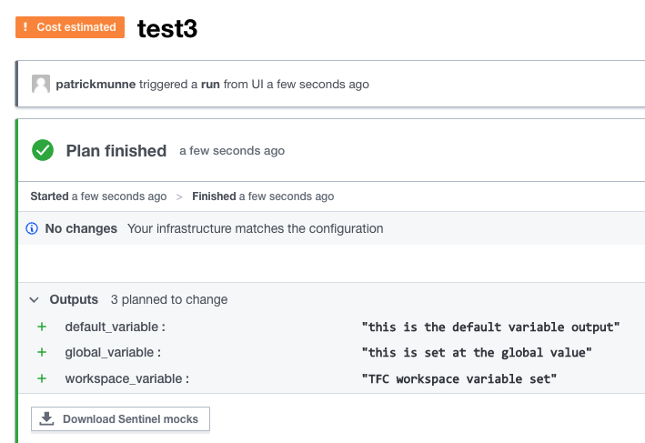

# tfc_variable_output
tfc variable output

# Example: Using variables with TFC

Within TFC and TFE you can add variable definitions add different levels [See documentation](https://www.terraform.io/cloud-docs/workspaces/variables#special-environment-variables) 

In the following step by step you will see the impact on what the variables do at different levels

# How to

- Clone/Fork this repository to your own VCS
- Within TFC make a new workspace that points to this repository  
- Run it for the first time. You will see the following output     
  
- On the workspace level add a variable with something different for default_variable  
  
- run a new plan  
  
- go to settings --> variable sets --> new variable set  
   
- Make a new run  
  

What happens when we add a global variables with the intention of changing the workspace variable and default variable?
- add 2 variables to your global variable settings    
  
- we see that only the default variable of the code is overwritten  
  
- change the global_variable at workspace level  
  
- You see in the bottem it gets overwritten  
  
- Realize where you set your variables

